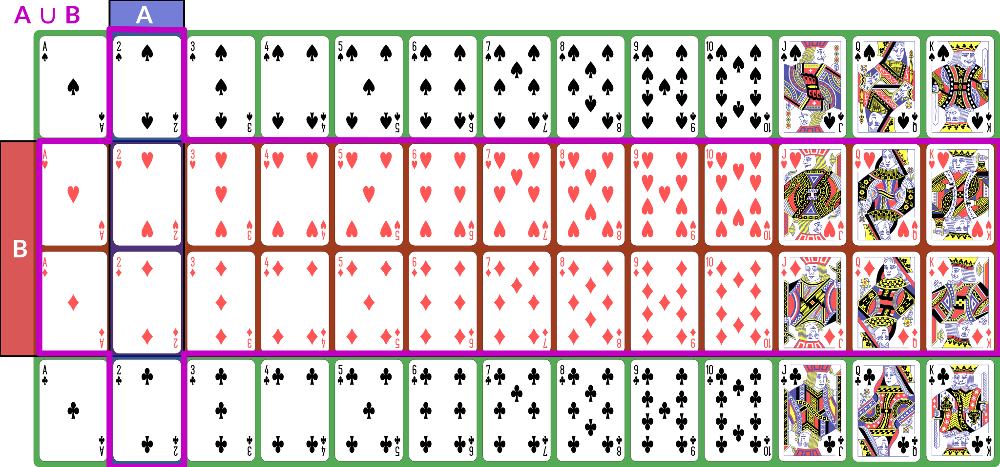

(probability=)
# Notes on Probability

This document summarizes key concepts in probability theory.
It is intended to be a concise reference for what we will be using, not a thorough tutorial exposition.

The concepts in this note are introduced in [Week 4](../week4/index.md).

## Set Concepts and Notation

- A set $A$ is an *unordered* collection of distinct elements.
- $\emptyset$ is the empty set.
- $A \cup B$ is the **union**: all elements in either $A$ or $B$ (or both).
- $A \cap B$ is the **intersection**: all elements in both $A$ and $B$.
- $A \setminus B$ is the **set difference**: all elements in $A$ but not in $B$.
- If $A$ is a subset of some larger set $U$ that contains all the possible elements under consideration, then the **complement** $A^c = U \setminus A$ is the set of elements *not* in $A$.
- $|A|$ is the *cardinality* (or *size*) of $A$. It may be infinite.
- $\mathcal{P}(A)$ is the *power set* of $A$: the set of all subsets of $A$.

### Kinds of Sets

There are, broadly speaking, three kinds of sets in terms of their cardinality:

- **Finite** sets have a finite number of elements.  There is some natural number $n$ such that $|A| = n$.
- **Countable** sets (or *countably infinite* sets) are infinite sets with the same cardinality as the set of natural numbers ($|A| = |\mathbb{N}|$).  Formally, there exists an isomorphism (a 1:1 onto mapping) between members of $A$ and $\mathbb{N}$.  Natural numbers, integers, rationals, and algebraics (rationals and roots) are all countable sets.
- **Uncountable** sets are infinite sets whose cardinality is larger than that of the natural numbers. The real numbers ($\mathbb{R}$) and the power set of the natural numbers ($\mathcal{P}(\mathbb{N})$) are two frequently-encountered uncountable sets.

We also talk about discrete and continuous sets:

- A **continuous** set $A$ with an ordering $<$ is a set where we can always find an element to fit between any two other elements: for any $a, b \in A$ such that $a < b$, there is a $c \in A$ such that $a < c < b$.
- A **discrete** set is a set that is not continuous: there are irreducible gaps between elements.

All finite sets are discrete.
The natural numbers and integers are also discrete.
The real numbers are continuous.
Rationals and algebraics are also continuous, but we won't be using them directly in this class.

```{note}
While $\mathbb{R}$ is continuous, the *floating-point numbers* are actually discrete and, technically, finite (there are only $2^{64}$ possible values of a 64-bit quantity).
However, we are usually using floats to represent reals, so for logical, mathematical purposes, we usually treat quantities represented in floats as continuous.
The representation is an approximation of the true quantities.
```

## Events

:::{index} Elementary Event
:::

A random process (or a process modeled as random) produces distinct individual outcomes, called **{term}`elementary events <elementary event>`**.
We use $E$ to denote the set of such outcomes; for a coin flip, $E = \{H, T\}$.
For a random process that produces a count, $E = \mathbb{N}$.

:::{index} Event
:::

Probability is defined over **events**.
An event $A$ is a subset of $E$ ($A \subseteq E$).
If elementary events are events, they are represented as *singletons*: $A = \{H\}$ means “coin is heads”.
$E$, the set of all elementary events, is the event “something happened”.

[cards]: https://en.wikipedia.org/wiki/Standard_52-card_deck

We use set operations to combine events (for these examples, we consider $E$ to be a deck of 52 [standard playing cards][cards]; $A$ is “2” and $B$ is “red card”):

:::{dropdown} Illustration

:::

-   $A \cap B$ is the event “both $A$ and $B$ happened”; for our example, the conjunction is “red 2”, of which there are 2 (2♥, 2♦).

    :::{dropdown} Illustration of $A \cap B$
    
    :::

-   $A \cup B$ is the event “either $A$ or $B$ (or both) happened”; for our example, the disjunction is “2 or red” — any 2, or any red card; this set has size 28: the 26 red cards (13 of each red suit), plus the two black 2s.

    :::{dropdown} Illustration of $A \cup B$
    
    :::

-   $A \setminus B$ is the event “$A$ happened but not $B$”. If $B \subseteq A$, then $A \setminus B = \emptyset$; for our example, the difference is “black 2”, because it is the set of 2s that are not red.

    :::{dropdown} Illustration of $A \setminus B$
    
    :::

With these definitions, we can now define the *event space*: $\Field$ is the set of all possible events (subsets of $E$).
This is a set of sets.
It does not necessarily contain *every* subset of $E$, but it has the following properties:

- $E \in \Field$.
- If $A \in \Field$, then its complement $A^c \in \Field$. We say $\Field$ is *closed under complement*.
    - Since $E \in \Field$ and $E^c = \emptyset$, $\emptyset \in \Field$.
- If $A_1, A_2, \dots, A_n \in \Field$, then their union $\bigcup_i A_i \in \Field$.  This applies also to unions of *countably many* sets.  We say $\Field$ is closed under *countable unions*.

$\Field$ is called a **sigma algebra** (or *sigma field*).
For a finite set $E$, we usually use $\Field = \mathcal{P}(E)$, the *power set* of $E$.
This means that every possible subset of $E$ (and therefore every conceivable set of elementary events) is an event.

Here are some additional properties of sigma algebras (these are listed separately from the previous properties because those are the *definition* of a sigma algebra and these are *consequences* — we can prove them from the definitions and axioms):

- If $A, B \in \Field$, $A \cap B \in \Field$

## Probability

Now that we have a sigma algebra, we can define the concept of **probability**.
A probability distribution (or *measure*) $\P$ over a sigma algebra $\Field$ is a function that obeys the following (Kolmogorov's axioms):

1.  $\P[E] = 1$ — the probability of something happening is 1.
2.  $\P[A] \ge 0$ — **non-negativity**: probabilities are not negative.
3.  If $A_1, A_2, \dots, A_n$ are (countably many) *disjoint* events in $\Field$, then $\P[\bigcup_i A_i] = \sum_i \P[A_i]$ (**countable additivity**).

A collection of disjoint sets is also called **mutually exclusive**.  What it means is that for any $A_i, A_j$ in the collection, $A_i \cap A_j = \emptyset$ — the two events cannot both happen simultaneously.

We a field of events equipped with a probability measure $(E, \Field, \P)$ a
**probability space**.

What this probability measure does is that it describes how “much” of the total
probability is associated with event. This is sometimes called the *probability
mass*, because probability acts like a conserved quantity (like mass or energy
in physics). There is a total probability of 1 (from the first axiom $\P[E] =
1$); the probability measure over other events tells us how likely they are
relative to other events by quantifying how much of the probability mass is
placed on them: if $\P[A] = 0.5$, that tells us that half the probability mass
is on event $A$.  This then has a variety of interpretations:

- Interpreted as a description of long-run frequencies, if we repeated the
  random process infinitely many times, half of the times should be $A$.
- Interpreted as an expectation of future observations of currently-unobserved
  outcomes, $A$ is just as likely as it is not.

The non-negativity axiom keeps us from trying to assign negative probabilities
to events because they won't be meaningful, and the countable additivity axiom
ensures that probabilities “make sense” in a way consistent with describing a
distribution of mass across the various events.  If we have two distinct,
disjoint events, then the probability mass assigned to the pair is the sum of
their individual masses; the axiom generalizes this to countable sets of
disjoint events.

:::{lnote} Aside
There do exist probability frameworks in which negative probability makes sense,
but they are unusual and we won't be needing them.
:::

Some additional facts about probability that can be derived from the above
axioms:

- $\P[A] \le 1$ (combined with non-negativity, we have $0 \le \P[A] \le 1$)
- $\P[A \cup B] = \P[A] + \P[B] - \P[A \cap B]$
- $\P[A^c] = 1 - \P[A]$
- $\P[A \setminus B] = \P[A] - \P[A \cap B]$
- If $A \subseteq B$, then $\P[A] \le \P[B]$

```{warning}
We have to be careful with $\P[A \cup B]$ — a common mistake is to attempt to compute it as $\P[A] + \P[B]$.  However, this erroneously counts elements in the intersection $A \cap B$ twice.
With the examples from before, where $A$ is 2s and $B$ is red cards, the red 2s are included in both $\P[A]$ (since they are 2s) and $\P[B]$ (since they are red).  Subtracting the joint probability $\P[A \cap B]$ corrects for the double-counting and produces the correct result.  If $A$ and $B$ are disjoint (they can never happen at the same time), then $\P[A \cap B] = 0$, and we can see that the probability follows the rules for countable additivity.
```

(prob-conditional)=
## Joint and Conditional Probability

We define the **joint probability** $\P[A, B] = \P[A \cap B]$: the probability of both $A$ and $B$ happening in the same observation.
This is sometimes also written $\P[A; B]$, and commas and semicolons are sometimes mixed.  This is usually to separate different *kinds* of events in the probability statement.

The **conditional probability** $\P[B|A]$, read “the probability of $B$ given $A$”, is the probability of $B$ *conditioned on* the knowledge that $A$ has happened.

Conditional and joint probabilities decompose as follows:

- $\P[A,B] = \P[A|B] \P[B]$
- $\P[A,B] = \P[B|A] \P[A]$

From this we can derive **Bayes' theorem**:

$$\P[B|A] = \frac{\P[A|B] \P[B]}{\P[A]}$$

We can **marginalize** a **joint distribution** by summing. If $\mathcal{B} = {B_1, B_2, \dots, B_n}$ is a collection of mutually exclusive events that span $E$, then:

$$\P[A] = \sum_{B \in \mathcal{B}} \P[A, B]$$

We call $\mathcal{B}$ a *partition* of $E$.
By “span $E$”, we mean that for any $e \in E$, there is some $B_i \in \mathcal{B}$ such that $e \in B_i$.

## Independence

Two events are **independent** if knowing the outcome of one tells you nothing about the probability of the other.
The following are true if and only if $A$ and $B$ are independent:

- $\P[A|B] = \P[A]$
- $\P[B|A] = \P[B]$
- $\P[A, B] = \P[A] \P[B]$

(random-variables)=
## Continuous Probability & Random Variables

If $E$ is continuous (typically $E = \mathbb{R}$), then we can't meaningfully talk about the probabilities of elementary events.
The probability that an observation is *exactly* any particular value $x \in \mathbb{R}$ is (typically) zero.

Instead, we define a sigma field where events are *intervals*:

- $E = \mathbb{R}$
- $\Field$ is the set of **intervals**, their complements, and their countable unions.  It contains infinitesimally small intervals, but not singletons.

This is not the only way to define probabilities over continuous event spaces, but it is the common way of defining probabilities over real values.
This particular sigma-field is called the [*Borel sigma algebra*](https://mathworld.wolfram.com/BorelSigma-Algebra.html), and we will denote it $(\mathbb{R}, \mathcal{B})$.
  
We often talk about continuous distributions as the distribution of a **random variable** $X$.
A random variable is a variable that takes on random values.
We can (often) *observe* or *sample* a random variable.

We define continuous probabilities in terms of a **distribution function** $F_X$:

$$F_X(x) = \P[X < x]$$

This is also called the {term}`cumultaive distribution function` (CDF).

We can use it to compute the probability for any interval:

$$\P[x_1 \le X < x_2] = F_X(x_2) - F_X(x_1)$$

This probability is called the **probability mass** on a particular interval.

Distributions are often defined by a **probability density function** $p$ such that

$$F(x) = \int_{-\infty}^x p(x_*) dx_*$$

Unlike probabilities or probability mass, densities *can* exceed 1.
When you use `sns.distplot` and it shows the kernel density estimator (KDE), it is showing you an estimate of the density.
That is why the $y$ axis is weird.

We can also talk about joint and conditional continuous probabilities and densities.
When marginalizing a continuous probability density, we replace the sum with an integral:

$$p(x) = \int p(x,y) dy$$

```{note}
Technically, a random variable for a probability space $(E, \mathcal{F}, P)$ is a function $f_X: E \to \mathbb{R}$.
For our purposes in this class, we can just treat random variables directly as the results of a probability space $(\mathbb{R}, \mathcal{B}, P)$.
```

## Expectation

The **expected value** of a random variable $X$, $\E[X]$, is its *mean*.
It is computed as the weighted sum over the possible values of $x$, where the weight for each value is its probability (or density).
For discrete $X$ with probability measure $P$, we have:

$$\E[X] = \sum_{x \in X} x \P[x]$$

If $X$ is continuous and has probability density $p$, we have:

$$\E[X] = \int x p(x) dx$$

```{note}
If we use the technical definition of a random variable, then we denote:

$$\E_P[f_X] = \int f_X(e) \P[e] de$$
```

We can also talk about the **conditional expectation** $\E[X | A]$, the expected value of $X$ given that we know event $A$ happened.
It is defined as $\E[X|A] = \int x p(x|A) dx$.

(prob-variance)=
## Variance and Covariance

The **variance** of a random variable $X$ is the expected value of its squared deviation from its mean:

$$\Var(X) = \E[(X - \E[X])^2]$$

The **standard deviation** is the square root of variance ($\sigma_X = \sqrt{\Var(X)}$).

The **covariance** of two random variables is the expected value of the product of their deviations from mean:

$$\Cov(X, Y) = \E[(X - \E[X]) (Y - \E[Y])]$$

The **correlation** $r_{XY} = \frac{\Cov(X, Y)}{\sigma_X \sigma_Y}$.

We can also show that $\Var(X) = \Cov(X, X)$.

Random variables can also be described as **independent** in the same way as events: knowing one tells you nothing about the other.
If two random variables are independent then their covariance $\Cov(X, Y) = 0$ (this implication is one-directional — there exist non-independent random variables whose covariance is 0).

## Properties of Expected Values

Expected value obeys a number of useful properties ($X$ and $Y$ are random variables, and $\alpha$, $\beta$, etc. are real numbers):

- **Linearity of expectation**:
    - $\E[X + Y] = \E[X] + \E[Y]$
    - $\E[\alpha X] = \alpha \E[X]$
- If $X$ and $Y$ are independent, then $\E[XY] = \E[X] \E[Y]$
- If $\E[X] = 0$, then $\Var(X) = \E[X^2]$
- If $\E[X] = \E[Y] = 0$, then $\Cov(X, Y) = \E[X Y]$

## Expectation of Indicator Functions

Sets can be described as an *indicator function* (or *characteristic function*) $\IND_A: E \to \{0,1\}$.
This function is defined as:

$$\IND_A(x) = \begin{cases}
1 & x \in A \\
0 & x \not\in A
\end{cases}$$

Then the **expected value** of this function is the same as the probability of $A$:

$$\E[\IND_A(X)] = \P[A]$$

(prob-odds)=
## Odds

Another way of computing probability is to compute with **odds**: the ratio of probabilities for or against an event.
This is given by:

$$\Odds(A) = \frac{\P[A]}{\P[A^c]} = \frac{\P[A]}{1 - \P[A]}$$

The **log odds** are often computationally convenient, and are the basis of logistic regression:

$$\log \Odds(a) = \log \P[A] - \log (1 - \P[A])$$

The {term}`logit function` converts probabilities to log-odds.

We can also compute an **odds ratio** of two outcomes:

$$\OR(A, B) = \frac{\Odds(A)}{\Odds(B)}$$

## Interpretation

So far, this document has focused on probability as a mathematical object: we
have a probability space obeying a set of axioms, and we can do various things
with it.  We have not, however, discussed what a probability *is*.  Is it a
description of frequencies?  Something else?

Under the **instrumentalist** school of thought, the mathematical definition
above *is* what a probability is.  Probability is a measure over a sigma algebra
that satisfies Kolmogorov's axioms, nothing more, nothing less.  In this view,
all other interpretations of probability are simply applications of probability.

**Frequentism** defines probability as the long-run behavior of infinite
sequences: the probability of an event is the fraction of times it would appear
if we repeated the experiment or observation infinitely many independent times.
$\P[H] = 0.5$ because, if we flip a coin infinitely many times, half of the
results will be heads.

**Subjectivism** or **subjective Bayesianism** defines probability as a
consistent description of the beliefs of a rational agent.  That is, it
describes what the agent currently believes about as-yet-unobserved outcomes.
$\P[H] = 0.5$ because, prior to flipping a coin, the agent believes heads to be
just as likely as tails.

There are variants on these theories and other theories as well.  They may seem
similar, but they are very different in terms of their implications and
application.  For one thing, under frequentism, probabilities only make sense in
the context of repeated (or theoretically repeatable) random events, and we
cannot talk about the probability of a fixed but unknown thing, such as a
population parameter.  Under subjective Bayesianism, because probability is
about the agent's subjective state of belief, we *can* talk about the
probability of a population parameter, because all we are doing is describing
the agent's belief about the parameter's value.

:::{note}
When I use the term *subjective* above, I am not using it in a perjorative or
negative sense. I am using it in its philosophical sense: it is the agent's
internal state, which is not necessarily shared with other agents.  Different
rational agents may have different current beliefs, each entirely rational and
well-justified, because they have access to different prior information. There
is nothing positive or negative about this; it is just a fact.
:::

## Further Reading

[This thread by Michael
Betancourt](https://twitter-thread.com/t/1576885053044699138) provides a good
overview of the *instrumentalist* idea of probability, which treats
probabilities simply as their mathematical objects. It influenced how I write about mass above.

If you want to dive more deeply into probability theory, Michael Betancourt's case studies are rather mathematically dense but quite good:

- [Probability Theory (For Scientists and Engineers)](https://betanalpha.github.io/assets/case_studies/probability_theory.html)
- [Conditional Probability](https://betanalpha.github.io/assets/case_studies/conditional_probability_theory.html)
- [Product Placement](https://betanalpha.github.io/assets/case_studies/probability_on_product_spaces.html) (probability over product spaces)

For a book:

- [<cite class=free>Introduction to Probability for Data Science</cite>](https://probability4datascience.com/) by Stanley H. Chan
- [<cite class=free>Introduction to Probability</cite>](https://chance.dartmouth.edu/teaching_aids/books_articles/probability_book/amsbook.mac.pdf) by Grinstead and Snell
- [<cite class=free>An Introduction to Probability and Simulation</cite>](https://bookdown.org/kevin_davisross/probsim-book/) — a hands-on online book using Python simulations
- <cite>A Probability Path</cite> by Sidney Resnick
